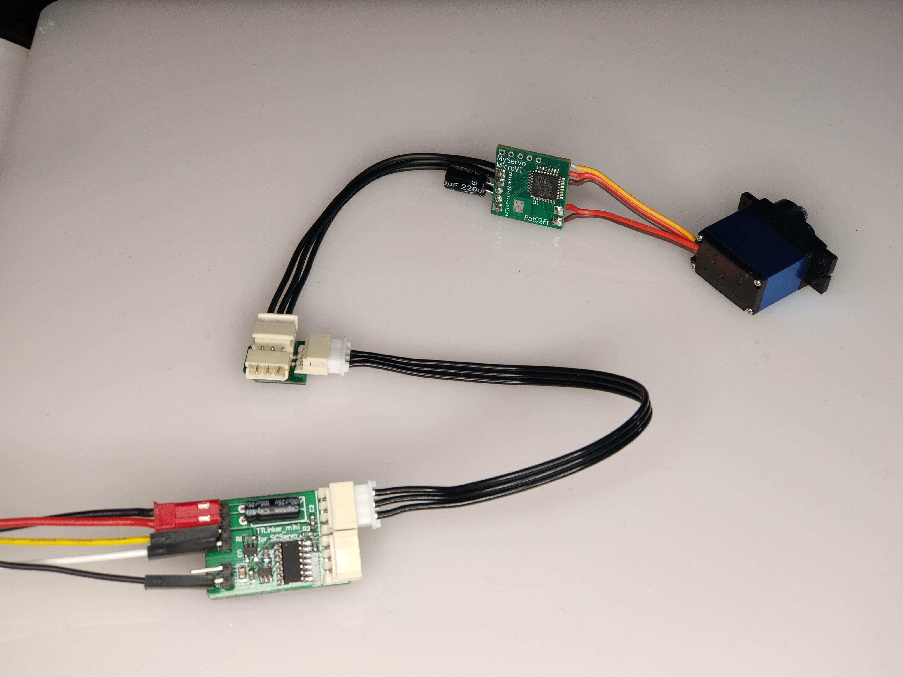

# SMSMod
 Smarter Micro Servo (SMS) MOD

This projet is a tiny control board for micro servo. It replaces the genuine servo control board and provides a smart bus interface (TTL level, Up to 1Mbps) and configurable close-loop regulation for robotic applications. Any micro and mini servo may be hacked and driven by this board (5-pin interface : 2 for DC motor, 3 for potentiometer). The control board may be directly powered by a LIPo 2S battery (min 6.5V, max 10V). 

Commercial off-the-shelf smart 3-pin cables, hubs, accessories and physical interface adapter boards (e.g. TTLinker) may be used to connect the hacked servo to the host controller (Arduino board, Arm-based board, RPi, and Jetson). User can drive up to 254 servo, with the same bus.

Position, velocity, and torque of each servo are controlable. Present position, velocity, and torque feedback are avaible. Communication protocol is developed for Python and C/C++ Arduino. Ping, read, write, sync write, reboot, factory reset commands are supported. One command takes about 1ms to be processed with a return status.
